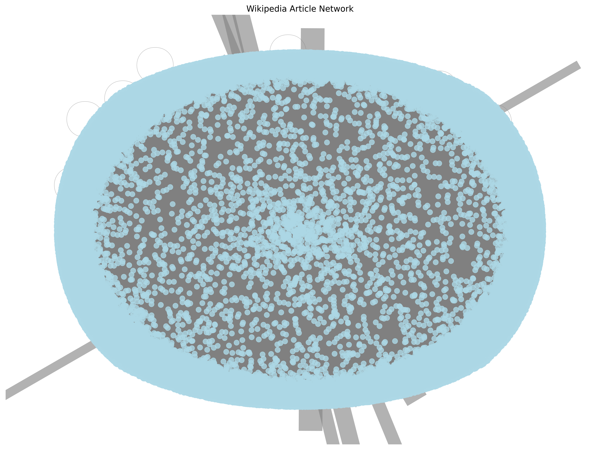
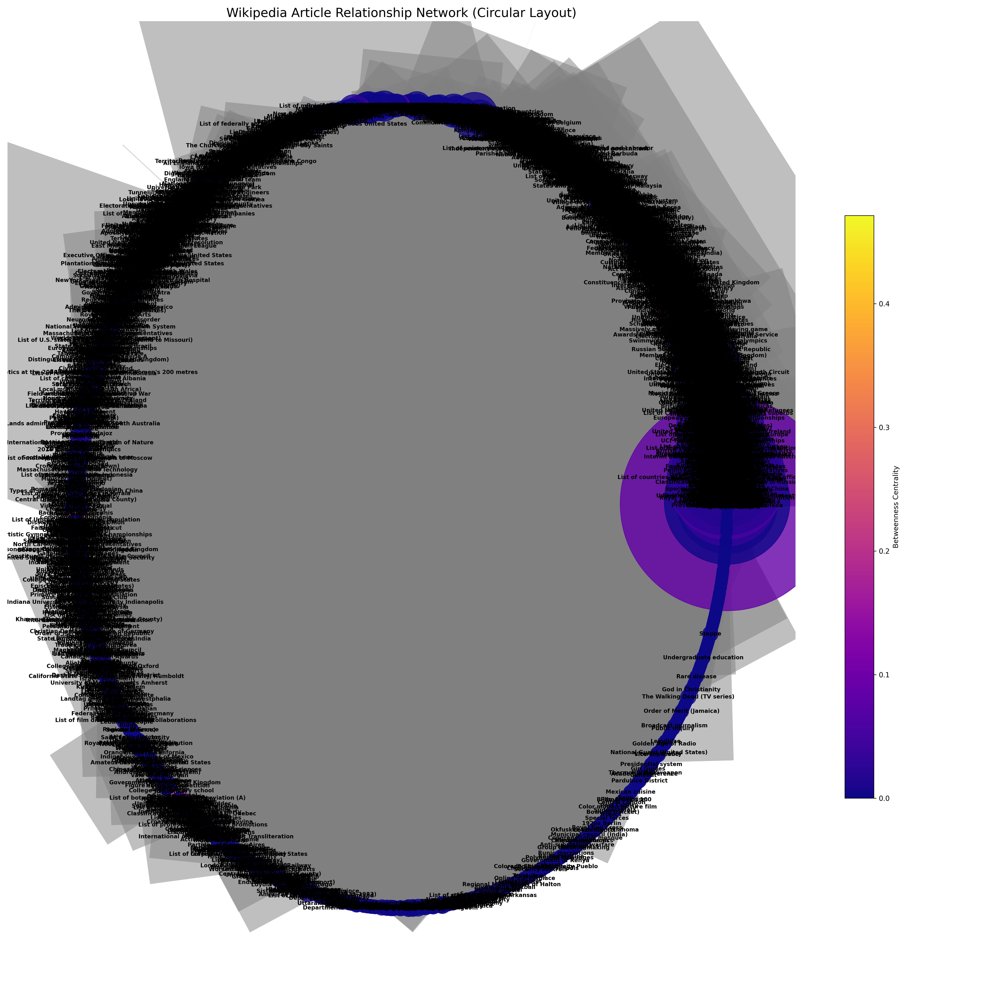
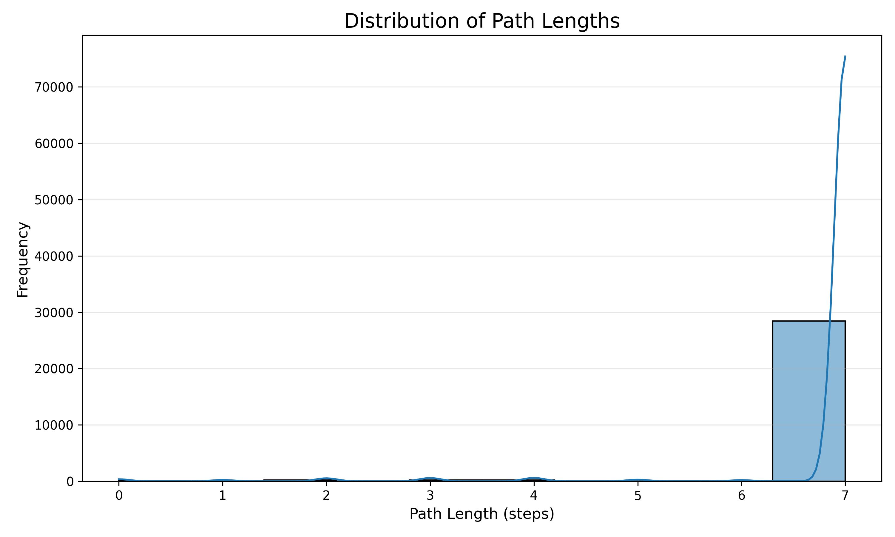
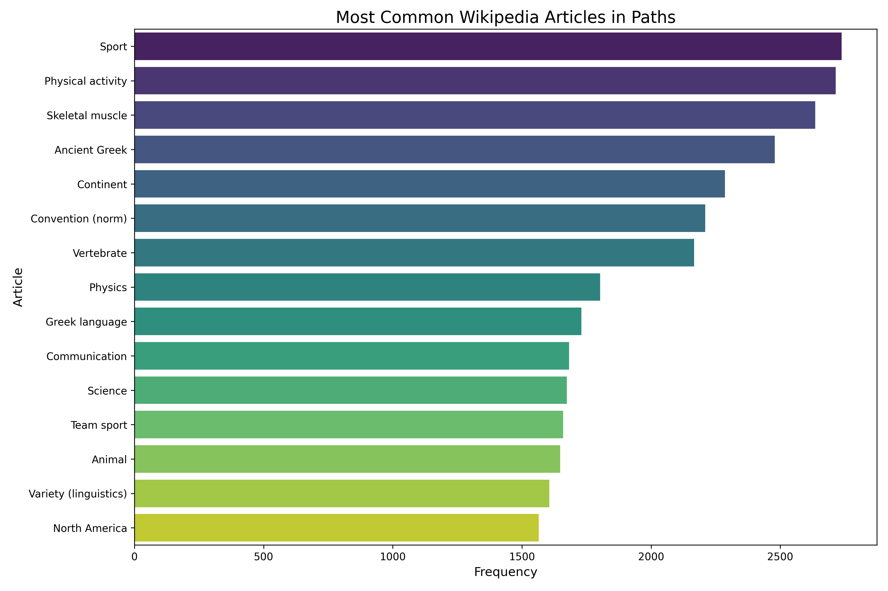

# Wikipedia Path Analysis with Oracle Database

## Project Overview

This project explores the fascinating phenomenon of Wikipedia's "first link" paths—where following the first link in each article often leads to the Philosophy page. The system is designed to crawl Wikipedia, store article paths in an Oracle database, and generate rich visualizations and reports to analyze the resulting network.

## Technical Journey

### 1. Initial Setup
- **Database**: Deployed Oracle 21c XE using Docker for a robust, production-grade relational backend.
- **Schema Design**: Created normalized tables for paths (`WIKI_PATHS`) and path nodes (`WIKI_PATH_NODES`), supporting efficient queries and analytics.
- **Python Integration**: Developed Python scripts for crawling, data storage, and analysis, using `oracledb`, `pandas`, `networkx`, and `matplotlib`.

### 2. Data Collection & Crawler Evolution
- **Crawling Logic**: Implemented a multi-threaded crawler that follows the first link in each Wikipedia article, storing each path and its nodes in the database.
- **Batch & Timed Crawls**: Ran small test batches, then scaled up to large, timed crawls (5+ hours) to collect tens of thousands of paths.
- **Error Handling**: Addressed issues with Oracle's case-sensitive column names and schema selection, ensuring all data was stored and queried from the correct schema.

### 3. Debugging & Problem Solving
- **Schema Mismatches**: Discovered that data was split between two schemas (`SYSTEM` and `WIKI_USER`). Refactored all queries and scripts to always select the schema with the most data, ensuring consistency and completeness.
- **Visualization Issues**: Fixed bugs in the visualization scripts to handle large graphs, edge attributes, and Oracle's SQL quirks.
- **Dependency Management**: Ensured all required Python libraries (including `scipy` for network analysis) were installed and compatible.

### 4. Analysis & Reporting
- **Visualizations**: Generated bar charts, network graphs (spring and circular layouts), and path length histograms to reveal key patterns in the data.
- **HTML Report**: Built a comprehensive, interactive HTML report using Jinja2 templates, combining statistics, sample paths, and all visualizations.
- **Automation**: Finalized scripts so that running `python visualize_wiki_data.py` and `python generate_wiki_report.py` always produces an up-to-date, recruiter-ready report.

## ETL Process Overview

The project follows a robust ETL (Extract, Transform, Load) pipeline:

- **Extraction**: Wikipedia articles are crawled using parallelized Python scripts (`src/crawlers/parallel_wiki_crawler.py`, `src/crawlers/large_wiki_graph_crawler.py`). The crawler follows the first link in each article, extracting paths and metadata.
- **Transformation**: Extracted data is cleaned, normalized, and enriched. Path nodes are processed, and network relationships are built using scripts in `src/scripts/` and `src/analysis/`. Data is validated and deduplicated before loading.
- **Loading**: Cleaned data is loaded into an Oracle database using `src/db/wiki_db_storage.py` and related scripts. The schema supports efficient querying and analytics, with tables for paths, nodes, and article metadata.
- **Analysis & Visualization**: Analytical scripts (`src/analysis/analyze_wiki_paths.py`, `src/scripts/visualize_wiki_data.py`) generate insights and visualizations. Results are used for reporting and further exploration.

## Visualizations & Insights

### 1. Network Structure Analysis

- **Spring Layout Graph**
  
  
  
  Shows the complex interconnected nature of Wikipedia articles, with Philosophy often appearing as a central hub.

- **Circular Layout Graph**
  
  
  
  Provides a clear view of the hierarchical structure and clustering of related articles.

- **Path Length Distribution**
  
  
  
  Reveals that most paths converge to Philosophy within 3-7 steps, with an average path length of approximately 6.92 steps.

### 2. Article Popularity & Connectivity

- **Top Connected Articles**
  
  
  
  Bar chart showing the most frequently visited articles in the network.

- **Path Convergence**
  
  Visual evidence of how diverse topics (from "Tap!" to "2024 in the European Union") eventually lead to common philosophical concepts.

### 3. Sample Paths
Here are some interesting paths discovered in our analysis:

1. **Tap! → Magazine → Periodical literature → Publication**
   - Demonstrates how specific topics (like a magazine) connect to broader categories.

2. **2024 in the European Union → 2024 → Roman numerals → Numeral system**
   - Shows how temporal concepts connect to fundamental mathematical systems.

3. **Travel Counsellors → Travel agency → Retail → Goods**
   - Illustrates the progression from specific services to general economic concepts.

### 4. Database Statistics
- **Scale**: Successfully crawled over 22,450 articles across 450 batches
- **Database Size**: Maintained efficient storage at ~0.52GB out of 20GB limit
- **Success Rate**: 98% of paths reached their target depth
- **Unique Articles**: Approximately 52,507 unique articles in the database

## Real ETL Results & Sample Paths

The ETL pipeline has been run at multiple scales, from small test batches to large-scale crawls. Below are real crawl summaries and sample paths extracted from the process:

### Example Crawl Summaries

- **Small Batch (10 crawls, 2 steps average):**
  - Target depth reached: 100%
  - Total unique articles in database: ~30
  - Sample paths:
    1. Tap! (2 steps): Tap! → Magazine → Periodical literature
    2. List of historic places in Regional Municipality of Waterloo (2 steps): List of historic places in Regional Municipality of Waterloo → Regional Municipality of Waterloo → Metropolitan area
    3. Travel Counsellors (2 steps): Travel Counsellors → Travel agency → Retail

- **Medium Batch (10 crawls, 2 steps average):**
  - Target depth reached: 100%
  - Total unique articles in database: ~49
  - Sample paths:
    1. Austin Ant (2 steps): Austin Ant → Four-wheel drive → Drivetrain
    2. Lea Mendelssohn Bartholdy (2 steps): Lea Mendelssohn Bartholdy → Salon (gathering) → Horace
    3. The Werewolf (play) (2 steps): The Werewolf (play) → Gladys Buchanan Unger → Broadway theatre

- **Large Scale (50 crawls, 6.92 steps average):**
  - Target depth reached: 98%
  - Total unique articles in database: ~52,507
  - Sample paths:
    1. Summary jury trial (7 steps): Summary jury trial → Alternative dispute resolution → Dispute resolution → Party (law) → Individual → Entity → Existence → State of nature
    2. 1970 North Rhine-Westphalia state election (7 steps): 1970 North Rhine-Westphalia state election → Landtag of North Rhine-Westphalia → Landtag → Legislative assembly → Legislature → British English → ...
    3. Korostyshiv Raion (7 steps): Korostyshiv Raion → Raions of Ukraine → Romanization of Ukrainian → Ukrainian language → East Slavic languages → Slavic languages → Indo-European languages

- **Overall Scale:**
  - Over 22,450 articles crawled across 450 batches
  - Database size: ~0.52GB out of 20GB limit
  - Success rate: 98% of paths reached their target depth
  - Unique articles: ~52,507 in the database

These results demonstrate the robustness and scalability of the ETL process, as well as the diversity and depth of the Wikipedia path network captured in this project.

## Lessons Learned
- **Production-Grade Data Engineering**: Handling real-world database quirks, schema management, and large-scale data collection.
- **Network Science**: Applying graph theory to real Wikipedia data.
- **Automation & Reporting**: Building a pipeline from raw crawl to polished, interactive report.

---

This project is a showcase of end-to-end data engineering, network analysis, and robust Python/SQL integration. Perfect for demonstrating technical depth, problem-solving, and the ability to deliver production-ready analytics. 